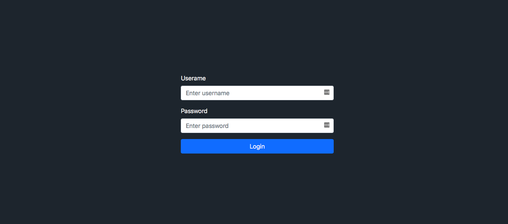
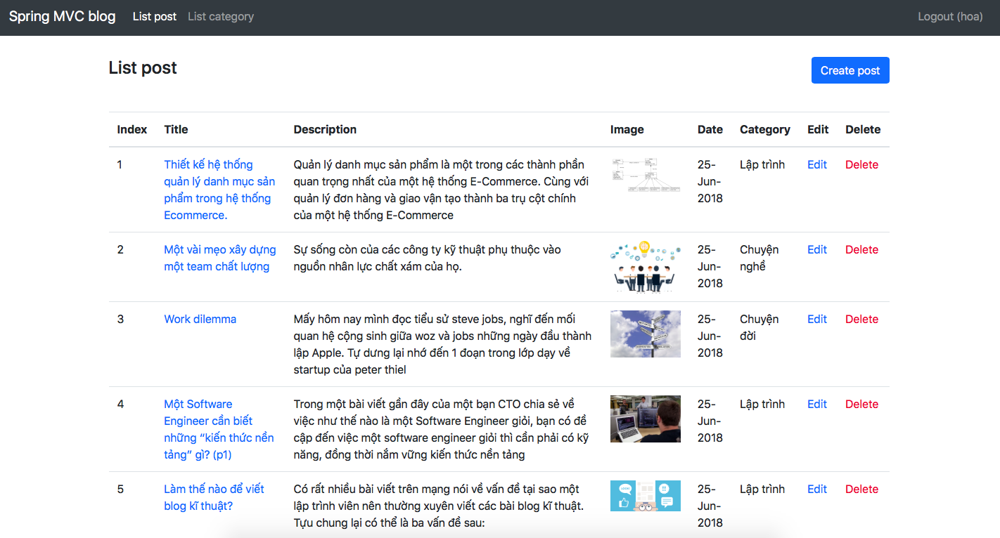
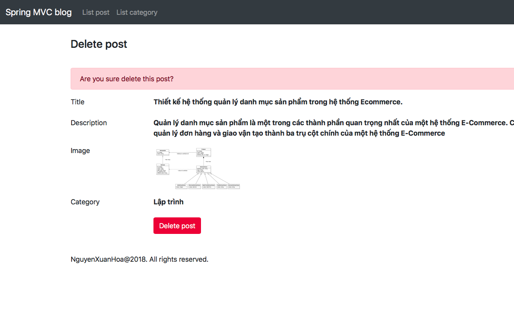
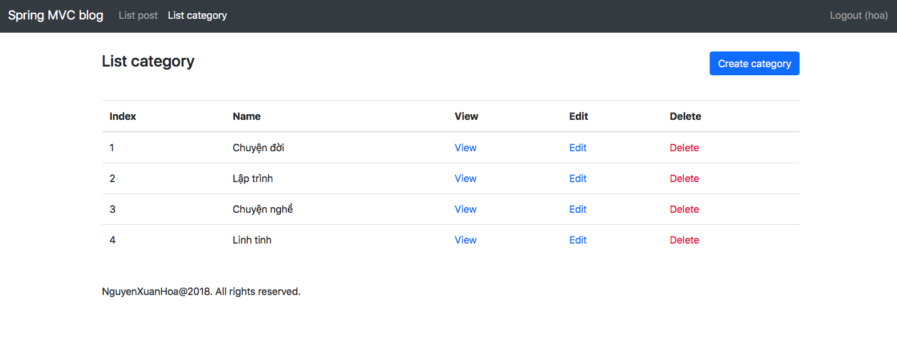
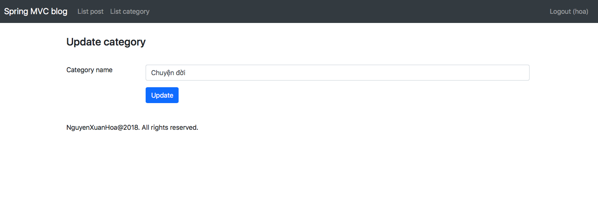
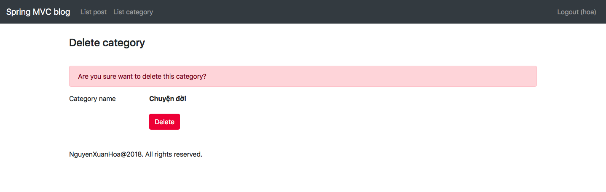
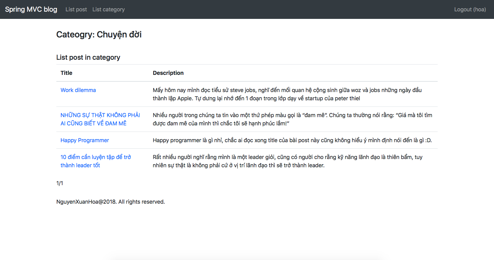
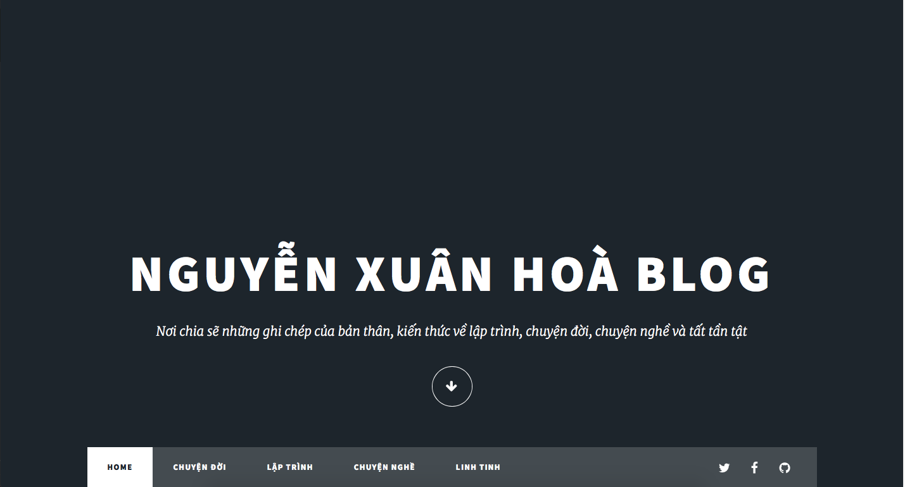
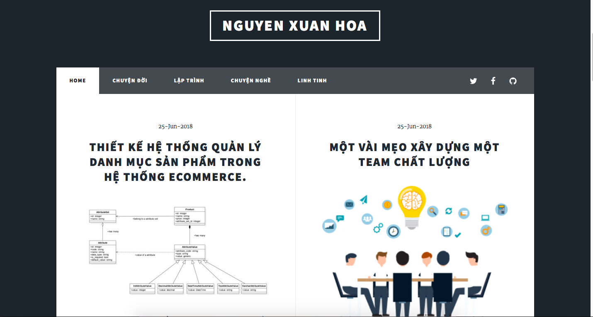
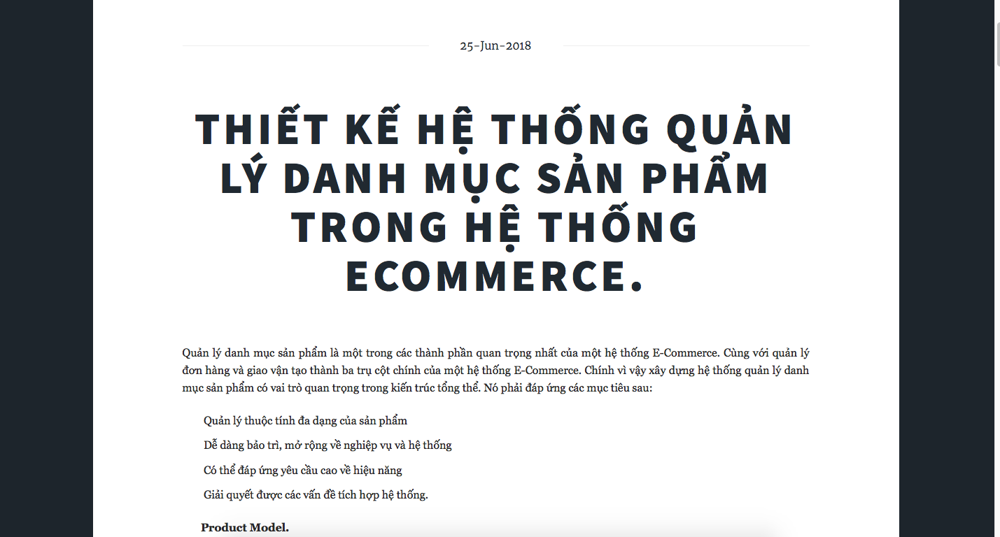

## Project base on Spring MVC

### Main Features

##### Admin
* Login
* Create post
* Update post
* Delete post
* Create category
* Update category
* Delete category
* View category and post in category

##### Site
* View list post
* View list post in category
* View single post

### Main technologies

* Java
* Spring MVC
* ORM
* Bootstrap
* RESTful API

### Screenshot

---

---
